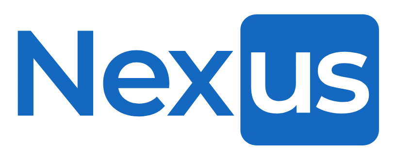

  

  <a href="https://nexus-zblj.onrender.com" target="_blank">NexUs&trade; : Connect with Yourself</a>

# Table of Contents
* [Background and Overview](#background-and-overview)
* [MVP Features](#mvp-features)
  * [Profile](#profile)
  * [Posts/Comments/Likes](#postscommentslikes)
  * [Alliances](#alliances)
  * [Experiences](#experiences)
  * [Search](#search)
* [Future Functionalities](#future-functionalities)
* [The Developer](#about-me)

# Background and Overview

Welcome to NexUs, an inter-universal professional networking social-media application based on the popular website LinkedIn. Connect with others AND yourself/yourselves from across the Multiverse! NexUs was carefully designed with an intuitive and user-friendly interface, ensuring a seamless user experience while navigating the app.

Enter the <a href="https://nexus-zblj.onrender.com" target="_blank" >Nexusverse</a>!

#### Technologies Used

* Languages: JavaScript, HTML5, CSS3
* Frontend: React-Redux
* Backend: Ruby on Rails
* Database: PostgresQL
* Photo Storage: AWS S3
* Hosting: Render

# MVP Features

## Profiles

From the splash, users have the option to sign-up as a new user, or login as a demo user. NexUs's authentication process is complete with custom error handling and a multi-step sign-up form very similar to LinkedIn's. 
Upon sign-up/sign-in, a user can update profile demographics and photos (see [AWS](#aws)).

## Posts/Comments/Likes

Users can utilize full CRUD functionality for posts, comments, and likes, with update/delete restricted to only the logged-in user's content. Posts are rendered on the feed page using infinite scroll/lazy loading technology.

## Alliances

## Experiences

## Search

## AWS

NexUs optimizes Amazon S3 for profile pictures, cover photos, and post images, ensuring seamless storage, retrieval, and updates. A reliable and secure solution, S3 empowers users to effortlessly share and manage their visual content within the platform."

## Future Functionalities

#### Expanded Search Capability
* Users will be able to utilize a search bar during the itinerary creation process to search by any desired keyword.
* Users will have the option to view the next 3 activities if they did not like any of the first set of suggestions.

## About Me

## Thanks for Reading!

**NexUs&trade;** was brought to fruition from a 4-day sprint. We hope you enjoy our app, have fun, and safe travels. Bon voyage! 

 

  

<!--  -->
