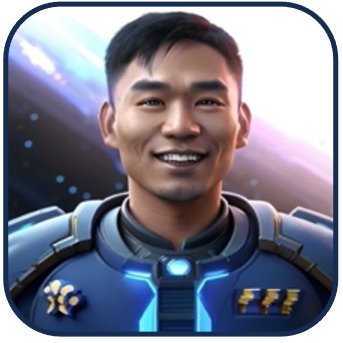

  

  <a href="https://nexus-zblj.onrender.com" target="_blank">NexUs&trade; : Connect with Yourself</a>

# Table of Contents
* [Background and Overview](#background-and-overview)
* [MVP Features](#mvp-features)
  * [Profile](#profile)
  * [Posts/Comments/Likes](#postscommentslikes)
  * [Alliances](#alliances)
  * [Experiences](#experiences)
  * [Search](#search)
  * [AWS](#aws)
* [Future Functionalities](#future-functionalities)
* [The Developer](#about-me)

# Background and Overview

Join NexUs&trade; , the inter-universal professional networking social-media application based on the popular website LinkedIn. Connect with others AND yourself/yourselves from across the Multiverse! Create a stellar profile, forge intergalactic alliances, and share captivating content. Empowering professionals to build their network beyond boundaries, NexUs takes networking to new frontiers.

Enter the <a href="https://nexus-zblj.onrender.com" target="_blank" style="color: #0a66c2" >Nexusverse</a>!

#### Technologies Used

* Languages: JavaScript, HTML5, CSS3
* Frontend: React-Redux
* Backend: Ruby on Rails
* Database: PostgresQL
* Photo Storage: AWS S3
* Hosting: Render

# MVP Features

### Profiles

From the splash, users have the option to sign-up as a new user, or login as a demo user. NexUs's authentication process is complete with custom error handling and a multi-step sign-up form very similar to LinkedIn's. 
Upon sign-up/sign-in, a user can update profile demographics and photos (see [AWS](#aws)).

### Posts/Comments/Likes

Users can utilize full CRUD functionality for posts, comments, and likes, with update/delete restricted to only the logged-in user's content. Posts are rendered on the feed page using infinite scroll/lazy loading technology.

    useEffect(() => {
        const observer = new IntersectionObserver((entries) => {
            const first = entries[0];
            if (first.isIntersecting) {
                setIsLoading(true);
                dispatch(fetchPosts(page))
                    .then((hasMorePosts) => {
                        setIsLoading(false);
                        if (hasMorePosts) {
                            setPage(prevPage => prevPage + 1);
                        }
                    })
                    .catch((error) => {
                        setIsLoading(false);
                        setError(error.message);
                    });
            }
        }, { threshold: 0.5 });
        if (observerTarget.current) observer.observe(observerTarget.current);
        return () => observer.disconnect();
    }, [dispatch, page])

### Alliances

Users can form professional alliances across the multiverse by sending/accepting alliance requests to/from other users. There are 4 different conditions to be accounted for when conditionally rendering the connect button on any user's profile page, each with its specific styling and function.

    // custom selector to get the connection status between current user and profile user
    export const getConnectedStatus = state => {
        if (!state.user.user) return null;

        const currentUserId = state.session.user.id;
        const profileUserId = state.user.user.id;

        // filter through the connections to find only those relevent to the two users
        const connection = Object.values(state.connections.connectionsAll).find
            (connection => {
                return (connection.connectorId === currentUserId 
                && connection.connecteeId === profileUserId)
                    || (connection.connecteeId === currentUserId 
                    && connection.connectorId === profileUserId);
            });

        return connection ? connection.status : 'connect';
    }

Connection button is conditionally rendered based on what is received from the selector. If the profile page is the current user's, then no button is displayed.

    let buttonContent = null;
    if (currentUser.id !== parseInt(id) && connectionStatus) {
        if (connectionStatus === 'connected') {
            buttonContent = (
                <button className='other-user-message-button'>
                    <i className="fa-regular fa-paper-plane"></i>
                    Message
                    coming soon!
                </button>
            );
        } else if (connectionStatus === 'pending') {
            buttonContent = (
                <button className='other-user-pending-button'>
                    <i className="fa-solid fa-user-clock"></i>
                    Pending
                </button>
            );
        } else if (connectionStatus === 'connect') {
            buttonContent = (
                < button className='other-user-connect-button' onClick={handleConnect}>
                    <i className="fa-solid fa-user-plus"></i>
                    Connect
                </button>
            );
        }
    }

### Experiences

Users can add, view, update, or delete experiences displayed on their profile pages. 

### Search

Users can utilize a search bar with auto-complete implementation to find users across NexUs.

### AWS

NexUs optimizes Amazon S3 for profile pictures, cover photos, and post images, ensuring seamless storage, retrieval, and updates. To optimize performance, the default profile/cover photo images are stored in the local directory and displayed until a user uploads an image.

# Future Functionalities

#### WebSocket API
* Users will be able to carry private conversations with their alliances utilizing WebSocket API.

#### Expanded Post Functionality
* Users will be able to repost others' posts and embed videos on their posts.

# About Me

I am a fullstack software engineer proficient with a strong interest in creating seamless and intuitive user experiences. 
As a former Physical Therapist, I have redirected my passion for helping others and attention to detail towards the field of software engineering.
Connect with me on <a href="https://linkedin.com/in/brandonchoi28" target="_blank"  >LinkedIn!</a>

 
 

# Thanks for Reading!

The core features of **NexUs&trade;** were produced as a result of a 14 day full-stack solo project. What are you waiting for? Enter the Nexusverse <a href="https://nexus-zblj.onrender.com" target="_blank" style="color: #0a66c2" >here</a>!

 

  

